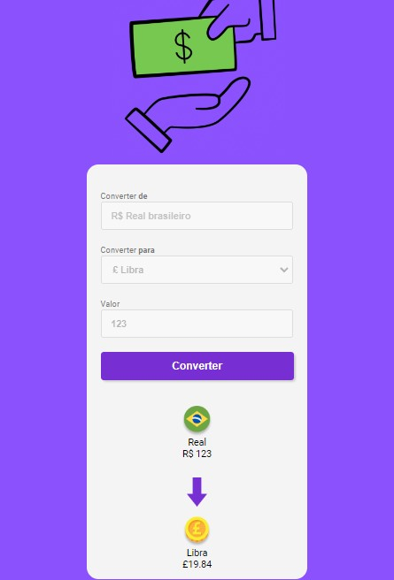

# 
 Conversor de Moedas - Desafio DevClub 

Desafio proposto pela DevClub.  
O projeto consiste em um conversor de moedas.

## Funcionalidades
* Reais para Dólares.
* Reais para Euro.
* Reais para Libras.
* Reais para Bitcoins.

## Ferramentas Utilizadas
* VSCode (IDE)
* HTML
* CSS
* JavaScript
* Figma

## Imagem do projeto

